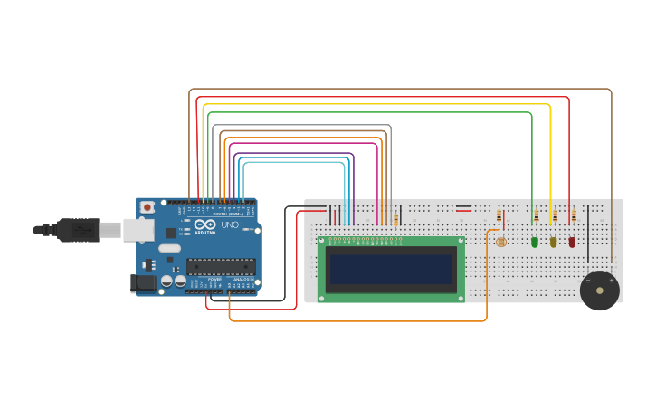

## 🍷 Vinheria Agnello – Sistema de Monitoramento de Luminosidade

## 🧩 Descrição do Projeto

Este projeto foi desenvolvido para a Vinheria Agnello, empresa fictícia, com o objetivo de monitorar a luminosidade do ambiente onde os vinhos são armazenados.
A qualidade do vinho depende diretamente das condições de temperatura, umidade e luminosidade, e, nesta primeira etapa, o foco é controlar a luminosidade por meio de um sensor LDR conectado ao Arduino.

O sistema utiliza LEDs para indicar o estado do ambiente, um buzzer para emitir alertas sonoros e um display LCD 16x2 que exibe informações e uma animação de boas-vindas.

## 🦾 Circuito

Abaixo está o circuito montado no Tinkercad:



## ⚙️ Funcionalidades

- Captura da luminosidade do ambiente usando um sensor LDR.

- Conversão do valor lido (0–1023) em porcentagem (0–100%) utilizando a função map().

- Exibição dos dados no display LCD, com uma mensagem animada de boas-vindas.

- Indicação do nível de luminosidade:

    - 🟢 *Verde* – Condição normal (entre 40% e 80%)

    - 🟡 *Amarelo* – Nível de alerta (30–40% ou 80–90%)

    - 🔴 *Vermelho* – Condição crítica (abaixo de 30% ou acima de 90%)

- Emissão de som pelo buzzer:

    - 3 bipes no modo Alerta

    - Som contínuo de 3 segundos no modo Crítico

## 🧠 Conceitos Envolvidos

- *Sensor LDR (Light Dependent Resistor):* varia a resistência conforme a quantidade de luz incidente.

- *Conversor Analógico–Digital (ADC):* converte o sinal analógico (0–5V) em valores digitais de 0 a 1023.

- *Função map():* usada para transformar a faixa de leitura do LDR em porcentagem compreensível (0–100%).

- *Display LCD (16x2):* utilizado para mostrar mensagens e a animação do logo da Vinheria.

## 🧰 Componentes Utilizados
| Componente | Quantidade | Pino no Arduino |
|------------|------------|-----------------|
| Sensor LDR |  	1	  |        A0       |
| LED Verde  |  	1	  |        9        |
| LED Amarelo|  	1	  |        10       |
|LED Vermelho|  	1     |        11       |
|   Buzzer   |   	1     |    	   13       |
| Display LCD 16x2 | 1 | 2–8 (RS, E, D4–D7) |
| Resistores (220Ω–10kΩ) | 4 |	—  |

## 📂 Estrutura do Projeto
```plaintext
PROJETO VINHERIA AGNELLO - CP1 EDGE COMPUTING/
├── imgs/
│   └── circuito.png              # Imagem do circuito (montagem ou simulação)
├── vinheria_agnello/
│   └── vinheria_agnello.ino      # Código principal do sistema embarcado
└── README.md                     # Documentação do projeto
```

## 🔌 Esquema de Funcionamento

1. O **LDR** mede a quantidade de luz no ambiente.  
2. O **Arduino** converte o sinal analógico para digital e calcula a porcentagem.  
3. Dependendo da luminosidade:
   - Acende o **LED correspondente** (verde, amarelo ou vermelho).  
   - Aciona o **buzzer** conforme o nível de alerta.  
4. O **display LCD** mostra a luminosidade e o status atual.  
5. Na inicialização, o LCD exibe uma **animação com o logo da Vinheria Agnello**.

## 💻 Dependências

- **Biblioteca do LCD:**  
  Incluída por padrão na IDE do Arduino.  

  ```cpp
  #include <LiquidCrystal.h>

- IDE do Arduino: versão 1.8.x ou 2.x

## 🪛 Como Reproduzir o Projeto

1. Monte o circuito conforme a tabela de pinos acima.
2. Conecte o Arduino ao computador via cabo USB.
3. Abra o código no Arduino IDE (.ino).
4. Vá em:
    - 👉 Ferramentas → Placa → Arduino Uno
    - 👉 Porta → COMx (porta do seu Arduino)
5. Clique em Verificar ✅ e depois em Enviar ⬆️.
6. Observe no LCD e LEDs as leituras de luminosidade e os alertas sonoros.

## 👥 Integrantes do Grupo

- Lara Mofid Essa Alssabak – RM: 567947

- Maria Luisa Boucinhas Franco – RM: 567355

- Roberta Moreira dos Santos – RM: 567825

## 📅 Etapa 1 do Projeto Vinheria Agnello

Desenvolvimento de um sistema de monitoramento da luminosidade utilizando Arduino, com indicadores visuais e sonoros e um display LCD com logo animado da empresa.